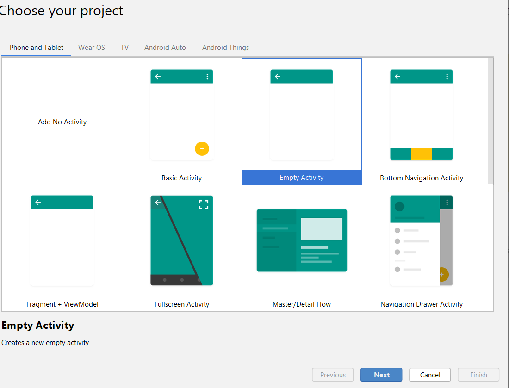

# Steg 1 - Skapar [!DNL Android]-app och konfigurerar att använda [!DNL Firebase Cloud Messaging]

I den här delen skapar du [!DNL Android]-appen som tar emot [!UICONTROL Push notifications] som skickas från Adobe Campaign Standard. Appen måste vara registrerad hos Google [!DNL Firebase Cloud Service] för att få push-meddelanden.

1. Logga in på ditt [!DNL Firebase]-konto.

   [!DNL Firebase] är Google mobilplattform som hjälper dig att snabbt utveckla högkvalitativa appar. Om du inte har något [!DNL Firebase]-konto skapar du ett [härifrån](https://firebase.google.com).

2. Starta [!DNL Android Studio]
3. Klicka på **[!UICONTROL File]** > **[!UICONTROL New]** > **[!UICONTROL New Project].**
4. Markera **[!UICONTROL Empty Activity]** och klicka på **[!UICONTROL Next].**

   

5. Ange ett beskrivande namn för projektet.

   För den här demonstrationen har vi namngett vårt projekt som *[!DNL ACSPushTutorial]*

   

6. Acceptera standardpaketnamnen och klicka på **[!DNL Finish]** för att skapa projektet.
7. Projektstrukturen bör se ut ungefär som skärmbilden nedan

   

8. Klicka på **[!UICONTROL Tools]** > **[!UICONTROL Firebase].** (detta lägger till projektet i [!DNL Firebase])
9. Klicka på **[!UICONTROL Set up Firebase Cloud Messaging].**

   

10. Klicka på **[!UICONTROL Connect to Firebase].**
11. När appen är ansluten till Firebase klickar du på **[!UICONTROL Add FCM to your app].**
12. Klicka på **[!UICONTROL Accept Changes].**

   När du lägger till FCM i programmet måste du ge guiden tillåtelse att göra några ändringar i projektet.

   ![[!DNL add-fcm-to-your-app]](assets/firebase-add-fcm-to-app.PNG)

När appen har integrerats med Firebase bör du få ett meddelande som det som visas nedan:

![[!DNL fcm-successfull]](assets/android-firebase-success.PNG)

[Kontrollera att ditt projekt finns med i listan i [!DNL Firebase ]konsolen](https://console.firebase.google.com/)

## Konfigurera inställningar för [!UICONTROL Push Channel]

1. Logga in på konsolen [!DNL Firebase]
2. Öppna projektet **[!UICONTROL ACSPushTutorial]**.
3. Klicka på **kugghjulsikonen** och öppna projektinställningarna

   

4. Gå till fliken **[!UICONTROL Cloud Messaging]**.
5. Kopiera servernyckeln

   

6. Logga in på din Adobe Campaign Standard-instans
7. Klicka på **[!UICONTROL Adobe Campaign]** > **[!UICONTROL Administration]** > **[!UICONTROL Channels]** > **[!UICONTROL Mobile App].**
8. Välj lämplig **[!UICONTROL Mobile Application Property].**
9. Klicka på ikonen **[!DNL Android]** i avsnittet **[!UICONTROL Push Channel settings]**.
10. Klistra in servernyckeln i fältet för servernyckeln.

Om allt är bra ska du se ett SUCCESS-meddelande.

Sammanfattningsvis har vi skapat en [!DNL Android App] och kopplat [!DNL Android App] till [!DNL Firebase]. Vi anslöt sedan mobilappen i Adobe Campaign med [!DNL Android App] genom att klistra in servernyckeln för [!DNL Android]-appen i mobilappen i Adobe Campaign Standard.
